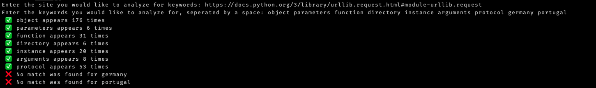

# Simple SEO Analyzer to check for keywords in a web page

## How it works

First Clone the repo
```
$ git clone git@github.com:jonathankamau/seo_check.git
```

Then cd into the repo and run the following:
```
python main.py
```
Type in the URL you would like to be analyzed and press enter. For example:
```
Enter the site you would like to analyze for keywords: https://docs.python.org/3/library/urllib.request.html#module-urllib.request
```

Next, type in the keywords seperated by a space. For example:
```
Enter the keywords you would like to analyze for, seperated by a space: object parameters function directory instance arguments protocol
```

Press enter and you will see an output similar to the one below:


## Built With:
Python 3.7

## Author
- Jonathan Kamau - [Github Profile](https://github.com/jonathankamau)